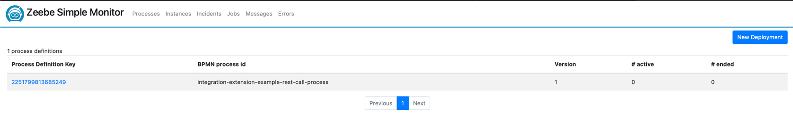

# springboot integration-service

## Requirements

For building and running the application you need:

- [JDK 11](https://www.oracle.com/cz/java/technologies/javase/jdk11-archive-downloads.html)
- [Maven 3](https://maven.apache.org)

## Running the application locally

There are several ways to run a Spring Boot application on your local machine. One way is to execute the `main` method
in the `de.codecentric.springbootsample.Application` class from your IDE.

Alternatively you can use
the [Spring Boot Maven plugin](https://docs.spring.io/spring-boot/docs/current/reference/html/build-tool-plugins-maven-plugin.html)
like so:

```shell
mvn spring-boot:run
```

## [Actuator monitoring](https://www.baeldung.com/spring-boot-actuators)

- [Powerflow documentation](https://notixsro.atlassian.net/wiki/spaces/DEVOPS/pages/627147110/Liveness+readiness+probes)

```shell
http://localhost:8080/actuator
```

## API documentation - in case of exposing REST API

### [OpenAPI 3 JSON](https://swagger.io/specification/)

```shell
http://localhost:8080/v3/api-docs
```

### [Swagger UI](https://swagger.io/tools/swagger-ui/)

```shell
http://localhost:8080/swagger-ui/
```

## Zeebe process deployment check in Zeebe Monitor



# Configuration

The application's entire configuration.

| Parameter's name                                            | Description                                                                                                             |
|-------------------------------------------------------------|-------------------------------------------------------------------------------------------------------------------------|
| `logging.level.cz.notix.zeebe.variables.WorkerVariableUtil` | **Purpose**: Log level zeebe-fw                                                                                         |
|                                                             | **Obligatory**: required, with a default value                                                                          |
|                                                             | **Type**: string                                                                                                        |
|                                                             | **Value**: `DEBUG`                                                                                                      |
|                                                             | **Possible values**: `DEBUG`/`INFO`/`ERROR`/`WARN`                                                                      |
|                                                             | **Version**: From version 1.0.0                                                                                         |
| `management.endpoints.web.exposure.include`                 | **Purpose**: List of endpoints for the application health checks                                                        |
|                                                             | **Obligatory**: required, with a default value                                                                          |
|                                                             | **Type**: string                                                                                                        |
|                                                             | **Value**: health,info,prometheus                                                                                       |
|                                                             | **Possible values**:                                                                                                    |
|                                                             | **Version**: From version 1.0.0                                                                                         |
| `management.endpoint.health.probes.enabled`                 | **Purpose**:                                                                                                            |
|                                                             | - Enabled liveness and readiness probes                                                                                 |
|                                                             | - see https://docs.spring.io/spring-boot/docs/current/reference/html/actuator.html#actuator.endpoints.kubernetes-probes |
|                                                             | **Obligatory**: required, with a default value                                                                          |
|                                                             | **Type**: boolean                                                                                                       |
|                                                             | **Value**: true                                                                                                         |
|                                                             | **Possible values**: `true`/`false`                                                                                     |
|                                                             | **Version**: From version 1.0.0                                                                                         |
| `management.health.livenessstate.enabled`                   | **Purpose**: Enables liveness probe.                                                                                    |
|                                                             | **Obligatory**: required, with a default value                                                                          |
|                                                             | **Type**: boolean                                                                                                       |
|                                                             | **Value**: true                                                                                                         |
|                                                             | **Possible values**: `true`/`false`                                                                                     |
|                                                             | **Version**: From version 1.0.0                                                                                         |
| `management.health.readynessstate.enabled`                  | **Purpose**: Enabled readiness probe                                                                                    |
|                                                             | **Obligatory**: required, with a default value                                                                          |
|                                                             | **Type**: boolean                                                                                                       |
|                                                             | **Value**: true                                                                                                         |
|                                                             | **Possible values**: `true`/`false`                                                                                     |
|                                                             | **Version**: From version 1.0.0                                                                                         |
| `management.metrics.export.prometheus.enabled`              | **Purpose**: Enabled metrics export to Prometheus                                                                       |
|                                                             | **Obligatory**: required, with a default value                                                                          |
|                                                             | **Type**: boolean                                                                                                       |
|                                                             | **Value**: true                                                                                                         |
|                                                             | **Possible values**: `true`/`false`                                                                                     |
|                                                             | **Version**: From version 1.0.0                                                                                         |
| `zeebe.client.broker.contact-point`                         | **Purpose**: Address to the Zeebe broker                                                                                |
|                                                             | **Obligatory**: required, with a default value                                                                          |
|                                                             | **Type**: string                                                                                                        |
|                                                             | **Value**: 127.0.0.1:26500                                                                                              |
|                                                             | **Possible values**:                                                                                                    |
|                                                             | **Version**: From version 1.0.0                                                                                         |
| `zeebe.init.broker.healthcheck-timeout`                     | **Purpose**: The duration (ms) between two connection status checks into the Zeebe broker.                              |
|                                                             | **Obligatory**: required, with a default value                                                                          |
|                                                             | **Type**: long                                                                                                          |
|                                                             | **Value**: 50000                                                                                                        |
|                                                             | **Possible values**: 500 - 100000                                                                                       |
|                                                             | **Version**: From version 1.0.0                                                                                         |
| `logging.level.cz.powerflow`                                | **Purpose**: Log level for PowerFLOW packages                                                                           |
|                                                             | **Obligatory**: required, with a default value                                                                          |
|                                                             | **Type**: enum                                                                                                          |
|                                                             | **Value**: `TRACE`                                                                                                      |
|                                                             | **Possible values**: `ERROR` / `WARN` / `INFO` / `DEBUG` / `TRACE`                                                      |
|                                                             | **Version**: From version 1.0.0                                                                                         |
| `logging.level.cz.notix`                                    | **Purpose**: Log level for Notix packages                                                                               |
|                                                             | **Obligatory**: required, with a default value                                                                          |
|                                                             | **Type**: enum                                                                                                          |
|                                                             | **Value**: `TRACE`                                                                                                      |
|                                                             | **Possible values**: `ERROR` / `WARN` / `INFO` / `DEBUG` / `TRACE`                                                      |
|                                                             | **Version**: From version 1.0.0                                                                                         |
| `powerflow.service.url`                                     | **Purpose**: URL into PowerFLOW Service integration                                                                     |
|                                                             | **Obligatory**: optional                                                                                                |
|                                                             | **Type**: string                                                                                                        |
|                                                             | **Value**: `http://localhost:5500`                                                                                      |
|                                                             | **Possible values**: `http://localhost:5500`/`https://some-hostname.cloud`..                                            |
|                                                             | **Version**: From version 1.0.0                                                                                         |

#Integrations

## Internal integrations

Ports mapping within internal infrastructure.

| Inbound ports | Outbound ports                    |
|---------------|-----------------------------------|
|               | HTTP 8080 (pwf-service, optional) |
|               | ZEEBE 26500 (zeebe)               |

## External integrations

Mapping of external integrations - outside of the current infrastructure or domain.

Example:

| From a module / a system | Into the module / system | Protocol   | Type   | Popis / Purpose |
|--------------------------|--------------------------|------------|--------|-----------------|
| External service         | Client external system   | HTTP/HTTPS | Online |                 |

## Copyright

PowerFLOW a.s.
